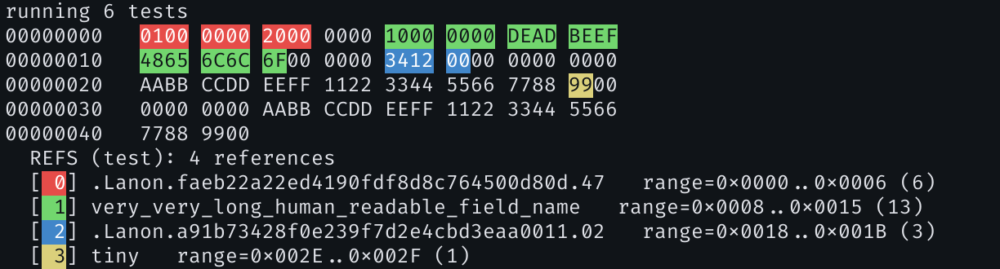

# semdump — Add semantic annotations to your hexdump

[](https://crates.io/crates/semdump)
[](LICENSE)

Plain hexdumps are dull. We can add colors to make them fancier — but that alone doesn't tell you *what* the bytes mean.
That's why `semdump` was born.

`semdump` is a crate for rendering annotated hexdumps of binary data. It highlights specific byte ranges and labels them with human-readable names, turning an opaque wall of hex into something you can actually understand at a glance.

## Related projects

There are several projects with a similar purpose:

- [`colored-hexdump`](https://crates.io/crates/colored-hexdump) — a crate that adds colors based on byte value.
- [`ImHex`](https://github.com/WerWolv/ImHex) — a hex editor that adds multiple decoding functionalities to a regular hex view.

Unlike these tools, `semdump` is focused on **semantic annotations**: it lets you attach meaningful labels to arbitrary byte ranges, so the dump conveys structure and intent rather than just raw values.

## Features

- Attach named references to arbitrary byte ranges in a hexdump (currently non-overlapping only)
- Fully zero-copy — works with borrowed data via `Cow<[u8]>`
- Pluggable output formatting via the `Formatter` trait allowing implementing custom renderers (tui, html, etc.)
- Built-in `ColorFormatter` with ANSI color output and `AnnotateFormatter` with next-line annotations.

## Quick start

Add `semdump` to your `Cargo.toml`:

```toml
[dependencies]
semdump = "0.1"
```

## Usage

```rust
use semdump::{SemanticDump, DataPart, ColorFormatter};

let mut dump = SemanticDump::new(0);
let mut data_part = DataPart::from_bytes(vec![0x01, 0x02, 0x03, 0x04]);
data_part.push_ref(0..2, "header")
         .push_ref(2..4, "payload");
dump.push_part(data_part);

let formatter = ColorFormatter::new(std::io::stdout());
dump.render(formatter).unwrap();
```

You can also use gaps and global references to build more complex dumps:

```rust
use semdump::{SemanticDump, DataPart, ColorFormatter};

let mut dump = SemanticDump::new(0);

dump.push_part(DataPart::from_bytes(vec![0x01, 0x02, 0x03, 0x04]))
    .add_global_ref(0..2, "first two bytes")
    .add_global_ref(2..4, "last two bytes")
    .push_gap(16)
    .push_part(DataPart::from_bytes(vec![0xAA, 0xBB, 0xCC, 0xDD]));

let formatter = ColorFormatter::new(std::io::stdout());
dump.render(formatter).unwrap();
```

This will print a colorful dump with highlighted byte ranges and a legend listing the references — making it easy to see which bytes correspond to relocations, struct fields, or any other semantic information.

Example output with data from test:



## License

This project is licensed under the [MIT License](LICENSE).